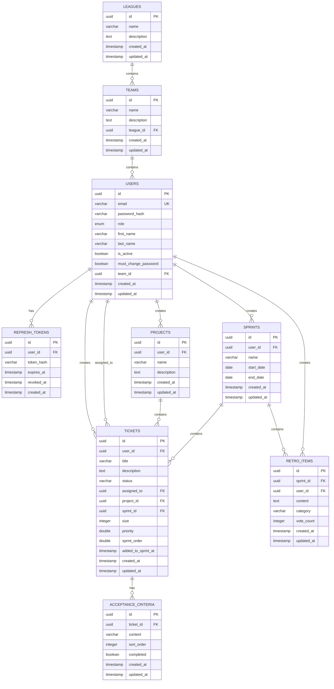

# Flyhalf

### A Very, Very Opinionated Agile Scrum Management System

**flyhalf /ˈflaɪˌhɑːf/ noun**

The flyhalf is a rugby team's primary playmaker and tactical leader who directs the team's attack. Flyhalves possess exceptional vision, game management, accuracy, and resilience.

---

## Table of Contents

- [Tech Stack](#tech-stack)
- [Features](#features)
- [Permission Model](#permission-model)
- [Project Structure](#project-structure)
- [Getting Started - Local Development](#getting-started---local-development)
- [User Interface](#user-interface)
- [API Documentation](#api-documentation)
- [Database Schema](#database-schema)
- [Security](#security)
- [AWS Production Deployment](#aws-production-deployment)
- [Monitoring & Troubleshooting](#monitoring--troubleshooting)
- [Contributing](#contributing)
- [License](#license)

---

## Tech Stack

### Backend
- **Language**: Go 1.24
- **Router**: chi v5 (lightweight HTTP router)
- **Database**: PostgreSQL 18 with pgx v5 driver
- **Authentication**: JWT access tokens (15min) + refresh tokens (7 days, HttpOnly cookie)
- **Password Hashing**: bcrypt (cost 12)
- **Security**: Rate limiting (5 req/s), request size limits (1MB), timeouts (10s)
- **Observability**: Health checks, metrics endpoint, structured logging
- **Development**: Air hot reload for rapid iteration

### Frontend
- **Type**: Vanilla JavaScript SPA with ES6 modules
- **Build**: No build step required - runs directly in browser
- **Styling**: Custom CSS3 (895 lines)
- **Server**: nginx Alpine
- **Charts**: Chart.js for burndown visualizations

### Infrastructure
- **Development**: Docker Compose with PostgreSQL 18
- **Production**: AWS (Terraform-managed)
  - **Compute**: ECS Fargate (serverless containers)
  - **Database**: RDS PostgreSQL 18
  - **CDN**: CloudFront with S3 origin
  - **Load Balancer**: Application Load Balancer with SSL/TLS
  - **Container Registry**: ECR with image scanning
  - **DNS**: Route53
  - **Monitoring**: CloudWatch logs, metrics, and alarms (optional)
  - **Secrets**: AWS Secrets Manager for credentials
  - **CI/CD**: GitHub Actions for automated deployment
  - **Estimated Cost**: $50-70/month

---

## Features

### Authentication & User Management
- JWT-based authentication with automatic token refresh
- User-friendly login error messages (invalid credentials, inactive accounts, network errors)
- Role-based access control (admin/user)
- Forced password change for newly created users
- Admin user management with team assignment
- User settings page and password change functionality

### Ticket Management
- CRUD operations with 5 status options: `open`, `in-progress`, `blocked`, `needs-review`, `closed`
- Priorities persist between application restarts using fractional indexing
- Optional ticket sizing: Small(1), Medium(2), Large(3), X-Large(5), Danger(8)
- Ticket assignment to users
- Assign tickets to projects and sprints
- 6-character unique ID for each ticket
- New tickets default to "open" status and appear at bottom of list
- **Acceptance Criteria**: Each ticket requires 1-6 acceptance criteria (max 256 chars each)
  - Add/remove criteria when creating or editing tickets
  - Check off criteria as completed with interactive checkboxes
  - Completion status preserved when editing tickets
  - Completed items shown with strikethrough styling
  - Real-time updates on ticket detail page
- **Updates**: Track ticket progress with timestamped updates (edit mode only)
  - Add up to 10 updates per ticket (max 500 chars each)
  - Each update displays relative timestamp (e.g., "2 hours ago")
  - Edit and delete updates as needed
  - Timestamps preserved when editing update content
  - No minimum update requirement
  - Available only when editing tickets (not during creation)

### Project Management
- CRUD operations with required name and description
- Organize tickets by assigning them to projects
- Project detail view shows all tickets assigned to that project
- Project names displayed as acronyms in ticket list (first 6 characters excluding spaces, uppercased)
- Simplified list view with detail-level actions

### Sprint Management
- CRUD operations for sprints (name and start date)
- **Sprint Board**: Interactive kanban with drag-and-drop
  - Three columns: Committed (open), Underway (in-progress/blocked/needs-review), Completed (closed)
  - Drag tickets between columns to update status
  - Auto-assigns unassigned tickets to the user who moves them
  - Clickable status badges in Underway column
  - Real-time status updates via API
  - Independent sprint board ordering with drag-and-drop reordering within columns
  - Tickets sorted by sprint order within each column
  - Responsive design with mobile support
- **Sprint Report**: Visual burndown chart and progress metrics
  - Story points and tickets cards with consistent layout and sizing
  - Total Points/Tickets, Committed, and Adopted in top row
  - Completed and Remaining in bottom row with matching alignment
  - Progress bars showing completion percentage
  - Burndown chart showing remaining points over sprint duration (starts one day before sprint)
  - Chart uses "Start" label for initial day to avoid timezone confusion
  - Accurate tracking with added_to_sprint_at timestamps
  - Powered by Chart.js for interactive visualization
- **Sprint Retrospective**: Team reflection board with voting on items

### Team Management (Admin Only)
- CRUD operations for teams with name and description
- Assign users to teams for organization
- Assign teams to leagues for hierarchical organization
- Team detail view shows all members and league affiliation
- Teams link in navbar for administrators

### League Management (Admin Only)
- CRUD operations for leagues with name and description
- Assign teams to leagues for hierarchical organization
- League detail view shows all member teams
- Leagues link in navbar for administrators (positioned after Teams)
- Teams can optionally belong to a league (nullable foreign key)
- Deleting a league preserves teams (league_id set to NULL)

### Demo Environment Management (Admin Only)
- **Reset Demo Environment**: Delete all tickets, sprints, and projects
  - Accessible from Settings page Danger Zone
  - Confirmation required before deletion
  - Shows deletion counts after completion
- **Reseed Demo Environment**: Create sample data for demonstration
  - Creates 1 project: "Demo Project"
  - Creates 1 sprint: "Demo Sprint" (14-day sprint starting today)
  - Creates 5 tickets with valid statuses (open, in-progress, needs-review, blocked, closed)
  - All demo items assigned to current admin user
  - Useful for testing, demos, and training

### Monitoring & Observability
- **Health Check Endpoint**: `/health` for load balancer and external monitoring
- **Metrics Endpoint**: `/metrics` returns runtime statistics (uptime, memory, goroutines)
- **CloudWatch Integration**: Optional alarms for CPU, memory, storage, and error rates
- **Structured Logging**: Comprehensive logging for debugging and auditing
- **Application Insights**: Real-time visibility into system health and performance

### Collaboration Model
- All users can view and edit all tickets, projects, and sprints
- Only administrators can delete items
- Secure HttpOnly cookies for refresh tokens
- Client-side routing with hash-based navigation that preserves state on refresh
- Responsive UI with modern card-based layouts

---

## Permission Model

| Permission | Regular Users | Administrators |
|------------|---------------|----------------|
| **Tickets, Projects, Sprints** | | |
| View all items | ✅ | ✅ |
| Create new items | ✅ | ✅ |
| Edit any item | ✅ | ✅ |
| Delete any items | ❌ | ✅ |
| **Ticket Management** | | |
| Assign tickets to projects and sprints | ✅ | ✅ |
| Manage ticket priorities (promote/demote) | ✅ | ✅ |
| Use sprint board with drag-and-drop | ✅ | ✅ |
| Check off acceptance criteria as completed | ✅ | ✅ |
| **User Management** | | |
| View own account settings | ✅ | ✅ |
| Change own password | ✅ | ✅ |
| Create new users | ❌ | ✅ |
| Edit user accounts | ❌ | ✅ |
| Delete users | ❌ | ✅ |
| Deactivate/activate users | ❌ | ✅ |
| **Team Management** | | |
| Create, edit, delete teams | ❌ | ✅ |
| Assign users to teams | ❌ | ✅ |
| Assign teams to leagues | ❌ | ✅ |
| **League Management** | | |
| Create, edit, delete leagues | ❌ | ✅ |
| Assign teams to leagues | ❌ | ✅ |
| **Demo Environment** | | |
| Reset demo environment (delete all data) | ❌ | ✅ |
| Reseed demo environment (create sample data) | ❌ | ✅ |

This collaborative permission model allows all team members to view and update work items while protecting data integrity.

---

## Project Structure

```
flyhalf/
├── api/                      # Go backend
│   ├── cmd/server/          # Application entry point
│   ├── internal/            # Private application code
│   │   ├── auth/           # Authentication & JWT
│   │   ├── config/         # Configuration management
│   │   ├── database/       # DB connection & migrations
│   │   ├── handler/        # HTTP request handlers
│   │   │   ├── health.go  # Health check endpoint
│   │   │   ├── metrics.go # Metrics endpoint
│   │   │   └── ...        # Other handlers
│   │   ├── middleware/     # HTTP middleware
│   │   │   ├── cors.go    # CORS configuration
│   │   │   ├── ratelimit.go # Rate limiting
│   │   │   └── ...        # Other middleware
│   │   ├── model/          # Data models & repositories
│   │   ├── router/         # Route definitions
│   │   └── util/           # Utility functions
│   │       ├── logger.go   # Logging utilities
│   │       ├── pagination.go # Pagination helpers
│   │       └── sanitize.go # Input sanitization
│   ├── Dockerfile          # Multi-stage build (dev/prod)
│   ├── go.mod             # Go dependencies
│   └── .air.toml          # Hot reload configuration
├── web/                     # JavaScript SPA frontend
│   ├── css/main.css        # Custom styling (895 lines)
│   ├── js/                 # JavaScript modules
│   │   ├── app.js         # Main entry point
│   │   ├── router.js      # Client-side routing
│   │   ├── auth.js        # Authentication state
│   │   ├── api.js         # API client
│   │   ├── config.js      # Development config
│   │   ├── config.production.js  # Production config
│   │   ├── components/    # UI components (navbar)
│   │   └── views/         # Page views (10 views)
│   ├── index.html         # Single HTML entry point
│   └── nginx.conf         # nginx configuration
├── ops/                     # Infrastructure & deployment
│   └── terraform/          # AWS infrastructure as code
│       ├── vpc.tf         # VPC and networking
│       ├── rds.tf         # PostgreSQL database
│       ├── ecs.tf         # ECS Fargate cluster
│       ├── alb.tf         # Application Load Balancer
│       ├── ecr.tf         # Container registry
│       ├── cloudfront.tf  # CDN for static files
│       ├── monitoring.tf  # CloudWatch alarms & SNS
│       ├── secrets.tf     # AWS Secrets Manager
│       ├── security_groups.tf
│       ├── outputs.tf
│       ├── variables.tf
│       └── backend.tf     # S3 remote state
├── .github/
│   └── workflows/
│       └── deploy.yml     # GitHub Actions deployment pipeline
├── scripts/                # Utility scripts
│   ├── create-admin.sql   # Initial admin user SQL
│   └── hash-password.go   # Password hashing utility
├── docker-compose.yml      # Local development orchestration
├── .env.example           # Environment variables template
└── README.md              # This file
```

---

## Getting Started - Local Development

### Prerequisites

- Docker and Docker Compose (or Podman and Podman Compose)
- Git

### Installation

1. **Clone the repository**:
```bash
git clone <repository-url>
cd flyhalf
```

2. **Review environment configuration**:
The `.env` file has already been created with secure JWT secrets. Review and modify if needed:
```bash
cat .env
```

3. **Start the application**:
```bash
docker-compose up
# or with Podman
podman compose up
```

This starts three services:
- **PostgreSQL** on port 5432
- **API** on port 8080 (with Air hot reload)
- **Web** on port 3000

4. **Wait for services to start**. You should see:
```
flyhalf-api    | Server starting on port 8080
```

### Creating the Initial Admin User

The application automatically runs database migrations on startup. To create an initial admin user:

```bash
# Connect to PostgreSQL and run seed script
docker exec -i flyhalf-db psql -U flyhalf -d flyhalf < scripts/create-admin.sql
```

**Default Admin Credentials:**
- Email: `admin@flyhalf.app`
- Password: `admin123`

**⚠️ IMPORTANT**: Change this password immediately after first login!

### Accessing the Application

Open your browser and navigate to:
```
http://localhost:3000
```

Log in with the admin credentials above.

### Development Workflow

#### Hot Reload
- **Go Backend**: Air automatically rebuilds and restarts the server on file changes
- **Frontend**: Simply refresh your browser - no build step required!

#### Running Tests
```bash
cd api
go test ./...
```

#### Adding Dependencies

**Go**:
```bash
cd api
go get <package>
go mod tidy
```

**Frontend**: No package manager needed - just add ES module imports!

---

## User Interface

### For All Users

#### Login & Authentication
- **Login Page** - Email/password authentication with user-friendly error messages
- **Force Password Change** - Required for newly created users on first login

#### Tickets
- **Tickets List** - View all tickets with status badges, size, assignee, project (acronym), sprint
  - Sorted by priority (promoted first), then by creation date
  - Sprint column shows sprint name with direct link to sprint board
  - Icon-based actions column: Promote to top, Promote up, Demote down, View, Edit
- **Ticket Detail** - Card-based layout with Key Information, Description, Acceptance Criteria, Updates, Project Details, Metadata
  - Interactive acceptance criteria checklist with real-time completion toggling
  - Completed criteria shown with strikethrough styling
  - Updates section displays timestamped updates with relative time (e.g., "2 hours ago")
  - Edit/delete buttons enabled for creator or admin
- **Create/Edit Ticket** - Structured form with organized sections
  - Basic Information: Title and description
  - Acceptance Criteria: 1-6 criteria in compact single-line inputs
    - Add/remove criteria with "Add AC" and "Remove" buttons
    - Edit mode shows completion checkboxes with strikethrough for completed items
    - Create mode has no completion status (all default to incomplete)
  - Assignment & Sizing: Assignee and size in 2-column grid
  - Project Organization (edit only): Status, project, sprint assignment
  - Updates (edit only): Add/edit/remove timestamped updates
    - Up to 10 updates per ticket (max 500 chars each)
    - Existing updates show relative timestamps
    - "Add Update" button (hidden when 10 updates reached)

#### Projects
- **Projects List** - View all projects with name
  - Click "View" for details
- **Project Detail** - Card layout showing acronym, description, assigned tickets
  - Edit/delete buttons in detail view
- **Create/Edit Project** - Form with name, description, and acronym generation guidance

#### Sprints
- **Sprints List** - View sprints with name, status, dates
  - "Board" and "Report" buttons for quick access
- **Sprint Detail** - Card layout with status calculation (upcoming/active/completed)
  - Duration and days remaining/until start
  - Timeline and assigned tickets
  - "View Board" and "View Report" buttons
- **Sprint Board** - Interactive kanban with drag-and-drop
  - Three columns: Committed, Underway, Completed
  - Drag tickets between columns to update status
  - Drag tickets within columns to reorder (independent sprint board ordering)
  - Automatically assigns unassigned tickets to the user who moves them
  - Clickable status badges in Underway column for quick status changes
  - Ticket counts in column headers
  - View ticket details with "View" link
- **Sprint Report** - Visual analytics
  - Story points and tickets progress with bars
  - Burndown chart (Chart.js)
  - Total/completed/remaining breakdown
- **Create/Edit Sprint** - Form with name and start date
  - End date automatically calculated (14-day sprint: start date + 13 days)

#### Settings
- **Settings Page** - Account information and password change form
  - **Danger Zone** (admins only): Reset and reseed demo environment controls

### Admin Only

#### User Management
- **User Management** - List all users with team assignment
  - Click "View" for details
- **User Detail** - Card layout with personal info, role, status, team
  - Edit/delete buttons
- **Create/Edit User** - Structured form
  - Personal Information: Name and email
  - Security (create only): Password with first-login change notice
  - Access & Permissions: Role, team, account status

#### Team Management
- **Team Management** - List all teams with league affiliation
  - League column shows which league the team belongs to
  - Click "View" for details
- **Team Detail** - Card layout with name, description, league, and team members
  - Shows league information with link to league detail page
  - Edit/delete buttons
- **Create/Edit Team** - Form with name, description, and league dropdown
  - Optional league selection from dropdown
  - "No League" option available

#### League Management
- **League Management** - List all leagues
  - Click "View" for details
- **League Detail** - Card layout with name, description, member teams
  - Shows all teams assigned to this league
  - Click team row to view team details
  - Edit/delete buttons
- **Create/Edit League** - Form with name and description

### Navigation
- Click **Flyhalf** logo to return to tickets list
- Click your **username** in navbar for settings
- **Tickets**, **Projects**, **Sprints** links for main sections
- **Users** link (admins only)
- **Teams** link (admins only)
- **Leagues** link (admins only)
- **Logout** button
- **Active link highlighting** - Current section auto-highlighted
- Page state preserved on refresh

### New User Workflow
1. Admin creates user with temporary password
2. User receives credentials and logs in
3. Immediately redirected to forced password change
4. Must change password before accessing application
5. After password change, redirected to tickets page

---

## API Documentation

### Base URL

**Local Development:**
```
http://localhost:8080/api/v1
```

**Production (AWS):**
```
https://api.flyhalf.app/api/v1
```

### Authentication Header

For authenticated requests, include the JWT access token:
```
Authorization: Bearer <access_token>
```

### Endpoints

#### Health & Monitoring

| Method | Endpoint | Description | Auth Required |
|--------|----------|-------------|---------------|
| GET | `/health` | Health check endpoint | No |
| GET | `/metrics` | Application metrics (JSON) | No |

**Health Check Response**:
```json
{
  "status": "ok"
}
```

**Metrics Response**:
```json
{
  "uptime_seconds": 3600,
  "goroutines": 10,
  "memory_alloc_mb": 12.5,
  "memory_total_mb": 15.2,
  "memory_sys_mb": 20.1
}
```

#### Authentication

| Method | Endpoint | Description | Auth Required |
|--------|----------|-------------|---------------|
| POST | `/auth/login` | Login with email/password | No |
| POST | `/auth/refresh` | Refresh access token | No (requires refresh token cookie) |
| POST | `/auth/logout` | Logout and revoke tokens | Yes |
| GET | `/auth/me` | Get current user info | Yes |
| PUT | `/auth/password` | Change password | Yes |

#### Tickets

| Method | Endpoint | Description | Role |
|--------|----------|-------------|------|
| GET | `/tickets` | List all tickets | Any |
| POST | `/tickets` | Create ticket | Any |
| GET | `/tickets/{id}` | Get ticket by ID (with acceptance criteria) | Any |
| PUT | `/tickets/{id}` | Update ticket | Any |
| DELETE | `/tickets/{id}` | Delete ticket | Admin |
| POST | `/tickets/{id}/promote` | Promote ticket to top | Any |
| POST | `/tickets/{id}/promote-up` | Promote up one position | Any |
| POST | `/tickets/{id}/demote-down` | Demote down one position | Any |
| PATCH | `/tickets/{id}/sprint-order` | Update sprint board order | Any |
| PATCH | `/tickets/{id}/acceptance-criteria/{criteriaId}` | Toggle acceptance criteria completion | Any |

**Ticket Fields**:
- `title` (string, required)
- `description` (string, required)
- `acceptance_criteria` (array of objects, required, 1-6 items)
  - `content` (string, required, 1-256 characters)
  - `completed` (boolean, default: false)
- `status` (string: open, in-progress, blocked, needs-review, closed, default: 'open')
- `assigned_to` (UUID, optional)
- `project_id` (UUID, optional)
- `sprint_id` (UUID, optional)
- `size` (integer, optional: 1=Small, 2=Medium, 3=Large, 5=X-Large, 8=Danger)
- `priority` (double, auto-managed by promote/demote features)

#### Projects

| Method | Endpoint | Description | Role |
|--------|----------|-------------|------|
| GET | `/projects` | List all projects | Any |
| POST | `/projects` | Create project | Any |
| GET | `/projects/{id}` | Get project by ID | Any |
| PUT | `/projects/{id}` | Update project | Any |
| DELETE | `/projects/{id}` | Delete project | Admin |

**Project Fields**:
- `name` (string, required)
- `description` (string, required)

#### Sprints

| Method | Endpoint | Description | Role |
|--------|----------|-------------|------|
| GET | `/sprints` | List all sprints | Any |
| POST | `/sprints` | Create sprint | Any |
| GET | `/sprints/{id}` | Get sprint by ID | Any |
| GET | `/sprints/{id}/report` | Get sprint report data | Any |
| PUT | `/sprints/{id}` | Update sprint | Any |
| DELETE | `/sprints/{id}` | Delete sprint | Admin |

**Sprint Fields**:
- `name` (string, required)
- `start_date` (date, required, format: YYYY-MM-DD)
- `end_date` (date, auto-calculated as start_date + 13 days for 14-day sprint)
- `status` (computed: upcoming/active/completed based on current date)

**Sprint Report Response**:
- `sprint` - Full sprint object
- `total_points`, `completed_points`, `remaining_points`
- `total_tickets`, `completed_tickets`
- `ideal_burndown` - Array of daily burndown points
- `tickets_by_status`, `points_by_status`

#### Users

| Method | Endpoint | Description | Role |
|--------|----------|-------------|------|
| GET | `/users` | List users for assignment | Any |

#### Admin

| Method | Endpoint | Description | Role |
|--------|----------|-------------|------|
| GET | `/admin/users` | List all users | Admin |
| POST | `/admin/users` | Create user | Admin |
| GET | `/admin/users/{id}` | Get user by ID | Admin |
| PUT | `/admin/users/{id}` | Update user | Admin |
| DELETE | `/admin/users/{id}` | Delete user | Admin |
| GET | `/admin/teams` | List all teams | Admin |
| POST | `/admin/teams` | Create team | Admin |
| GET | `/admin/teams/{id}` | Get team by ID | Admin |
| PUT | `/admin/teams/{id}` | Update team | Admin |
| DELETE | `/admin/teams/{id}` | Delete team | Admin |
| GET | `/admin/leagues` | List all leagues | Admin |
| POST | `/admin/leagues` | Create league | Admin |
| GET | `/admin/leagues/{id}` | Get league by ID | Admin |
| PUT | `/admin/leagues/{id}` | Update league | Admin |
| DELETE | `/admin/leagues/{id}` | Delete league | Admin |
| POST | `/admin/reset-demo` | Delete all tickets, sprints, projects | Admin |
| POST | `/admin/reseed-demo` | Create demo project, sprint, and 5 tickets | Admin |

---

## Database Schema



### Leagues
- `id` (UUID, PK)
- `name` (VARCHAR, not null)
- `description` (TEXT, nullable)
- `created_at`, `updated_at` (TIMESTAMP)

### Teams
- `id` (UUID, PK)
- `name` (VARCHAR, not null)
- `description` (TEXT, nullable)
- `league_id` (UUID, FK to leagues, nullable, ON DELETE SET NULL)
- `created_at`, `updated_at` (TIMESTAMP)

### Users
- `id` (UUID, PK)
- `email` (VARCHAR, unique, not null)
- `password_hash` (VARCHAR, not null)
- `role` (ENUM: 'admin', 'user')
- `first_name`, `last_name` (VARCHAR, not null)
- `is_active` (BOOLEAN)
- `must_change_password` (BOOLEAN, default: false)
- `team_id` (UUID, FK to teams, nullable)
- `created_at`, `updated_at` (TIMESTAMP)

### Refresh Tokens
- `id` (UUID, PK)
- `user_id` (UUID, FK to users, ON DELETE CASCADE)
- `token_hash` (VARCHAR)
- `expires_at` (TIMESTAMP)
- `revoked_at` (TIMESTAMP, nullable)
- `created_at` (TIMESTAMP)

### Projects
- `id` (UUID, PK)
- `user_id` (UUID, FK to users - creator)
- `name` (VARCHAR, not null)
- `description` (TEXT, not null)
- `created_at`, `updated_at` (TIMESTAMP)

### Sprints
- `id` (UUID, PK)
- `user_id` (UUID, FK to users - creator)
- `name` (VARCHAR, not null)
- `start_date` (DATE, not null)
- `end_date` (DATE, not null)
- `created_at`, `updated_at` (TIMESTAMP)
- Status is computed field (upcoming/active/completed)

### Tickets
- `id` (UUID, PK)
- `user_id` (UUID, FK to users - creator)
- `title` (VARCHAR, not null)
- `description` (TEXT, not null)
- `status` (VARCHAR: open, in-progress, blocked, needs-review, closed)
- `assigned_to` (UUID, FK to users, nullable)
- `project_id` (UUID, FK to projects, nullable)
- `sprint_id` (UUID, FK to sprints, nullable)
- `size` (INTEGER: 1, 2, 3, 5, 8, nullable)
- `priority` (DOUBLE PRECISION, default: 0, fractional indexing)
- `sprint_order` (DOUBLE PRECISION, default: 0, fractional indexing for sprint board ordering)
- `added_to_sprint_at` (TIMESTAMP, nullable, tracks when ticket was added to sprint for burndown accuracy)
- `created_at`, `updated_at` (TIMESTAMP)

### Acceptance Criteria
- `id` (UUID, PK)
- `ticket_id` (UUID, FK to tickets, ON DELETE CASCADE)
- `content` (VARCHAR(256), not null)
- `sort_order` (INTEGER, default: 0, for ordering criteria)
- `completed` (BOOLEAN, default: false)
- `created_at`, `updated_at` (TIMESTAMP)

### Retro Items
- `id` (UUID, PK)
- `sprint_id` (UUID, FK to sprints, ON DELETE CASCADE)
- `user_id` (UUID, FK to users - creator)
- `content` (TEXT, not null)
- `category` (VARCHAR(10), 'good' or 'bad')
- `vote_count` (INTEGER, default: 0)
- `created_at`, `updated_at` (TIMESTAMP)

**Relationships**:
- Leagues → teams (1:many, ON DELETE SET NULL)
- Teams → users (1:many, ON DELETE SET NULL)
- Users → refresh_tokens (1:many)
- Users → tickets (1:many as creator, 1:many as assignee)
- Users → projects (1:many)
- Users → sprints (1:many)
- Users → retro_items (1:many)
- Tickets → projects (many:1)
- Tickets → sprints (many:1)
- Tickets → acceptance_criteria (1:many, CASCADE delete)
- Sprints → retro_items (1:many, CASCADE delete)

---

## Security

### Authentication
- **Passwords**: Hashed with bcrypt (cost 12)
- **Access Tokens**: Short-lived (15 minutes), JWT with HS256, stored in memory only
- **Refresh Tokens**: 7-day expiry, HttpOnly + Secure + SameSite=Strict cookies
- **Password Reset**: Forced password change on first login for new users

### API Security
- **CORS (Cross-Origin Resource Sharing)**:
  - **Purpose**: Controls which domains can make API requests from browsers
  - **Configuration**: Set via `ALLOWED_ORIGIN` environment variable
  - **Development**: `http://localhost:3000` (default)
  - **Production**: `https://demo.flyhalf.app` (set in Terraform `ops/terraform/ecs.tf`)
  - **Security**: Uses origin allowlist (never wildcard `*`) with credentials enabled
  - **Implementation**: See `api/internal/middleware/cors.go` for detailed configuration
  - **Headers Set**:
    - `Access-Control-Allow-Origin`: Echoes back the validated origin
    - `Access-Control-Allow-Credentials: true` (enables cookies/auth headers)
    - `Access-Control-Allow-Methods`: GET, POST, PUT, PATCH, DELETE, OPTIONS
    - `Access-Control-Allow-Headers`: Content-Type, Authorization
    - `Access-Control-Max-Age: 3600` (1 hour preflight cache)
- **Rate Limiting**: 5 requests/second with burst of 10 on authentication endpoints
- **Request Size Limit**: 1MB maximum request body size
- **Request Timeout**: 10 seconds for all API requests
- **SQL Injection Protection**: Parameterized queries with pgx
- **XSS Protection**: All user inputs are HTML-escaped
- **Input Validation**: Strong password requirements, email validation
- **Security Headers**:
  - `X-Content-Type-Options: nosniff`
  - `X-Frame-Options: DENY`
  - `X-XSS-Protection: 1; mode=block`
  - `Referrer-Policy: strict-origin-when-cross-origin`

### Infrastructure Security
- **Database**: Private subnet, encrypted storage, no public access
- **API**: Private subnet, only accessible via load balancer
- **HTTPS/TLS**: SSL/TLS 1.2+ enforced on all endpoints
- **Container Scanning**: ECR automatically scans images for vulnerabilities
- **Secrets Management**:
  - AWS Secrets Manager for database passwords and JWT secrets
  - 7-day recovery window for deleted secrets
  - Never committed to git, passed as environment variables to ECS tasks
  - Local development uses `.env` file (not committed)

### Accessibility
- **Section 508 Compliant**: All color combinations meet WCAG 2.0 Level AA standards
- **Contrast Ratios**: Minimum 4.5:1 for normal text
- **Status Indicators**: Color-coded with sufficient contrast
- **Interactive Elements**: Clear visual indicators

---

## AWS Production Deployment

### Architecture Overview

The production deployment uses AWS services managed by Terraform:

```
┌─────────────────────────────────────────────────────────────┐
│                        Route53 DNS                          │
│    api.flyhalf.app    demo.flyhalf.app    db.flyhalf.app   │
└──────────┬──────────────────────┬──────────────────┬────────┘
           │                      │                  │
           ▼                      ▼                  │
    ┌─────────────┐       ┌──────────────┐          │
    │     ALB     │       │  CloudFront  │          │
    │  (HTTPS)    │       │    (CDN)     │          │
    └──────┬──────┘       └──────┬───────┘          │
           │                     │                   │
           ▼                     ▼                   │
    ┌─────────────┐       ┌──────────────┐          │
    │ECS Fargate  │       │  S3 Bucket   │          │
    │ (Go API)    │       │(Static Web)  │          │
    └──────┬──────┘       └──────────────┘          │
           │                                         │
           │          ┌──────────────────────────────┘
           └──────────▼
              ┌──────────────┐
              │RDS PostgreSQL│
              │(Private Only)│
              └──────────────┘
```

**Components**:
- **VPC**: Custom VPC with public/private subnets across 2 AZs
- **API**: ECS Fargate (0.25 vCPU / 512MB) in private subnet
- **Database**: RDS PostgreSQL 18 (db.t4g.micro) in private subnet
- **Load Balancer**: ALB with SSL/TLS termination
- **CDN**: CloudFront distribution with S3 origin (OAC)
- **Container Registry**: ECR with image scanning
- **DNS**: Route53 A records for all services
- **Monitoring**: CloudWatch logs, metrics, and alarms (optional)
  - ECS service CPU/memory alarms
  - RDS performance and storage alarms
  - ALB health and error rate alarms
  - SNS notifications for alarm events
- **Secrets Management**: AWS Secrets Manager for sensitive credentials
  - Database password
  - JWT access and refresh secrets
  - 7-day recovery window

**Estimated Monthly Cost**: $50-70
- NAT Gateway: ~$32/month (largest cost)
- ALB: ~$16/month
- RDS: ~$12/month (or free tier)
- ECS Fargate: ~$8/month
- CloudFront + S3: ~$1-5/month
- Other (ECR, logs): ~$1-3/month

### Prerequisites

Before deploying, ensure you have:

- [ ] AWS CLI installed and configured (`aws configure`)
- [ ] Terraform >= 1.0 installed
- [ ] Docker or Podman installed
- [ ] ACM certificate created for `*.flyhalf.app` in us-east-1
- [ ] Route53 hosted zone for `flyhalf.app`
- [ ] S3 bucket for Terraform remote state

### Deployment Steps

#### 1. Configure Terraform Backend

Navigate to the terraform directory:
```bash
cd ops/terraform
```

Copy and edit backend configuration:
```bash
cp backend.hcl.example backend.hcl
```

Edit `backend.hcl`:
```hcl
bucket = "your-terraform-state-bucket"
key    = "flyhalf/terraform.tfstate"
region = "us-east-1"
```

#### 2. Configure Infrastructure Variables

Copy and edit variables:
```bash
cp terraform.tfvars.example terraform.tfvars
```

Edit `terraform.tfvars`:
```hcl
# Required: Existing AWS Resources
acm_certificate_arn    = "arn:aws:acm:us-east-1:123456789012:certificate/abc-123"
route53_zone_id        = "Z1234567890ABC"
terraform_state_bucket = "your-terraform-state-bucket"

# Required: Secure Secrets
# Generate with: openssl rand -base64 32 | tr -d '/@" '
db_password        = "your-secure-password"
jwt_access_secret  = "your-jwt-access-secret"
jwt_refresh_secret = "your-jwt-refresh-secret"

# Optional: Override defaults
# db_username = "flyhalf"
# db_name = "flyhalf"
# api_desired_count = 1
# api_cpu = 256
# api_memory = 512

# Optional: Enable CloudWatch alarms and notifications
# enable_cloudwatch_alarms = true
# alarm_email = "your-email@example.com"
```

**⚠️ Security Note**: Never commit `terraform.tfvars` or `backend.hcl` to version control!

#### 3. Initialize and Deploy Infrastructure

```bash
# Initialize Terraform
terraform init -backend-config=backend.hcl

# Review the plan (creates 50+ resources including optional monitoring)
terraform plan

# Deploy infrastructure
terraform apply
```

**Expected Duration**: 10-15 minutes (RDS and CloudFront take the longest)

This creates:
- VPC with public/private subnets
- RDS PostgreSQL database
- ECS Fargate cluster (empty, no tasks yet)
- Application Load Balancer with SSL
- S3 bucket + CloudFront CDN
- ECR repository
- Route53 DNS records
- Security groups, IAM roles, CloudWatch logs
- AWS Secrets Manager secrets (database password, JWT secrets)
- CloudWatch alarms and SNS topic (if `enable_cloudwatch_alarms = true`)

#### 4. Configure GitHub Actions

After infrastructure is created, deployments are automated via GitHub Actions. The workflow triggers on:
- Push to `main` branch
- Manual workflow dispatch

**Setup GitHub Secrets**:
1. Go to your GitHub repository → Settings → Secrets and variables → Actions
2. Add the following secrets:
   - `AWS_ACCESS_KEY_ID` - Your AWS access key
   - `AWS_SECRET_ACCESS_KEY` - Your AWS secret key

**Update Workflow Variables** (`.github/workflows/deploy.yml`):
```yaml
env:
  AWS_REGION: us-east-1
  ECR_REPOSITORY: flyhalf-api
  ECS_CLUSTER: flyhalf-cluster
  ECS_SERVICE: flyhalf-api-service
  S3_BUCKET: your-s3-bucket-name        # Get from terraform output
  CLOUDFRONT_DISTRIBUTION_ID: YOUR_ID   # Get from terraform output
```

Get the S3 bucket name and CloudFront distribution ID:
```bash
terraform output web_bucket_name
terraform output cloudfront_distribution_id
```

#### 5. Deploy via GitHub Actions

**Automatic Deployment**:
Push to main branch to trigger automatic deployment:
```bash
git push origin main
```

**Manual Deployment**:
Alternatively, trigger a manual deployment from GitHub:
1. Go to Actions tab in your repository
2. Select "Deploy to AWS" workflow
3. Click "Run workflow"
4. Choose the branch and click "Run workflow"

**Expected Duration**: 5-8 minutes

The GitHub Actions workflow will:
1. **Deploy API**:
   - Build the Go API Docker image (cross-compiled to AMD64)
   - Push image to ECR with both git SHA and `latest` tags
   - Update ECS service to deploy new image
   - Wait for deployment to stabilize
2. **Deploy Web**:
   - Swap config to production version (`config.production.js` → `config.js`)
   - Upload static files to S3 with correct content types
   - Invalidate CloudFront cache

**Note**: The Dockerfile's `GOARCH=amd64` ensures the binary is x86-64 compatible even when building on Apple Silicon Macs.

#### 6. Monitor Deployment

View the deployment progress in GitHub Actions:
1. Go to your repository on GitHub
2. Click the "Actions" tab
3. Click on the running workflow
4. Monitor the progress of both API and Web deployment jobs

#### 7. Verify Deployment

After GitHub Actions completes:

```bash
cd ../terraform

# Get URLs
terraform output api_url          # https://api.flyhalf.app
terraform output web_url          # https://demo.flyhalf.app

# Test API health
curl https://api.flyhalf.app/health
# Expected: {"status":"ok"}

# Check application metrics
curl https://api.flyhalf.app/metrics
# Expected: {"uptime_seconds":123,"goroutines":10,"memory_alloc_mb":12.5,...}

# Test CORS
curl -H "Origin: https://demo.flyhalf.app" \
     -H "Access-Control-Request-Method: POST" \
     -H "Access-Control-Request-Headers: Content-Type" \
     -X OPTIONS \
     https://api.flyhalf.app/api/v1/auth/login -v
# Expected: Access-Control-Allow-Origin: https://demo.flyhalf.app

# Open web app
open https://demo.flyhalf.app
```

### GitHub Actions CI/CD

The project uses GitHub Actions for automated deployment. The workflow (`.github/workflows/deploy.yml`) runs two parallel jobs:

#### Deploy API Job
1. Checks out code
2. Configures AWS credentials
3. Logs into Amazon ECR
4. Builds Docker image for AMD64 (Fargate-compatible)
5. Pushes image to ECR with two tags:
   - Git commit SHA (e.g., `abc1234`)
   - `latest`
6. Updates ECS service to force new deployment
7. Waits for deployment to stabilize

#### Deploy Web Job
1. Checks out code
2. Configures AWS credentials
3. Prepares production config (`config.production.js` → `config.js`)
4. Syncs files to S3 with correct content types:
   - HTML files: `text/html`
   - JavaScript files: `application/javascript`
   - CSS files: `text/css`
5. Invalidates CloudFront cache to serve updated files

#### Workflow Triggers
- **Automatic**: Pushes to `main` branch
- **Manual**: Workflow dispatch from GitHub Actions tab

#### Required Secrets
- `AWS_ACCESS_KEY_ID` - AWS access key with permissions for ECR, ECS, S3, CloudFront
- `AWS_SECRET_ACCESS_KEY` - AWS secret key

### Configuration Details

#### Network & CORS

**API Backend**:
- Configuration: Reads from `ALLOWED_ORIGIN` environment variable
- Terraform sets: `https://demo.flyhalf.app` (in `ops/terraform/ecs.tf`)

**Web Frontend**:
- Development: `http://localhost:8080/api/v1`
- Production: `https://api.flyhalf.app/api/v1`
- Deployment script automatically swaps configs

#### Environment Variables

The ECS task definition sets these environment variables:
- `SERVER_PORT=8080`
- `DB_HOST=<rds-endpoint>`
- `DB_PORT=5432`
- `DB_USER=flyhalf`
- `DB_PASSWORD=<from-terraform-vars>`
- `DB_NAME=flyhalf`
- `DB_SSLMODE=require`
- `JWT_ACCESS_SECRET=<from-terraform-vars>`
- `JWT_REFRESH_SECRET=<from-terraform-vars>`
- `JWT_ACCESS_EXPIRY_MIN=15`
- `JWT_REFRESH_EXPIRY_DAY=7`
- `ALLOWED_ORIGIN=https://demo.flyhalf.app`
- `ENVIRONMENT=production`

### Common Deployment Commands

#### Deploy via GitHub Actions
Deployments are automated via GitHub Actions. To deploy:
```bash
# Push to main branch triggers automatic deployment
git push origin main

# Or trigger manually from GitHub Actions tab in your repository
```

#### Update Infrastructure
```bash
cd ops/terraform
terraform plan
terraform apply
```

#### View Outputs
```bash
terraform output              # All outputs
terraform output api_url      # Specific output
terraform output -json        # JSON format
```

### Useful Terraform Outputs

```bash
# Infrastructure
terraform output vpc_id
terraform output private_subnet_ids
terraform output public_subnet_ids

# API
terraform output api_url
terraform output alb_dns_name
terraform output ecr_repository_url
terraform output ecs_cluster_name
terraform output ecs_service_name

# Web
terraform output web_url
terraform output web_bucket_name
terraform output cloudfront_distribution_id

# Database
terraform output db_url
terraform output rds_endpoint
terraform output rds_address
```

### Cleanup

To destroy all resources:

```bash
cd ops/terraform

# Empty S3 bucket first (required)
aws s3 rm s3://$(terraform output -raw web_bucket_name)/ --recursive

# Destroy infrastructure
terraform destroy
```

**⚠️ Warning**: This deletes ALL resources including the database. Back up important data first!

---

## Monitoring & Troubleshooting

### CloudWatch Monitoring

The infrastructure includes comprehensive CloudWatch monitoring with automated alarms (optional, enabled via `enable_cloudwatch_alarms` variable):

#### Available Alarms

**ECS Service Alarms**:
- **CPU Utilization**: Triggers when average CPU > 80% for 10 minutes
- **Memory Utilization**: Triggers when average memory > 80% for 10 minutes

**RDS Database Alarms**:
- **CPU Utilization**: Triggers when average CPU > 80% for 10 minutes
- **Free Storage Space**: Triggers when free storage < 2 GB
- **Database Connections**: Triggers when connections > 20 (80% of max)

**Application Load Balancer Alarms**:
- **Unhealthy Hosts**: Triggers immediately when any target is unhealthy
- **5XX Errors**: Triggers when > 10 errors occur in 5 minutes
- **Response Time**: Triggers when average response time > 2 seconds for 10 minutes

#### SNS Notifications

All alarms publish to an SNS topic. To receive email notifications:

1. Uncomment the SNS subscription in `ops/terraform/monitoring.tf`:
   ```hcl
   resource "aws_sns_topic_subscription" "cloudwatch_alarms_email" {
     count     = var.enable_cloudwatch_alarms ? 1 : 0
     topic_arn = aws_sns_topic.cloudwatch_alarms[0].arn
     protocol  = "email"
     endpoint  = "your-email@example.com"
   }
   ```

2. Add `alarm_email` variable to `terraform.tfvars`:
   ```hcl
   enable_cloudwatch_alarms = true
   alarm_email             = "your-email@example.com"
   ```

3. Apply changes:
   ```bash
   terraform apply
   ```

4. Confirm the subscription in your email inbox

#### Viewing Metrics in AWS Console

Navigate to CloudWatch → Alarms to view alarm status and history. Metrics are automatically collected for:
- ECS service CPU and memory usage
- RDS instance performance and storage
- ALB request counts, response times, and error rates

### Application Metrics

The API exposes a `/metrics` endpoint (no authentication required) that returns:
- **Uptime**: Time since server started
- **Goroutines**: Number of active goroutines
- **Memory Usage**: Allocated, total, and system memory in MB

Example:
```bash
curl https://api.flyhalf.app/metrics
```

### Viewing Logs

#### API Logs
```bash
# Follow logs in real-time
aws logs tail /ecs/flyhalf-api --follow --region us-east-1

# View recent logs (last 10 minutes)
aws logs tail /ecs/flyhalf-api --since 10m --region us-east-1
```

#### RDS Logs
```bash
aws logs tail /aws/rds/instance/flyhalf-db/postgresql --region us-east-1
```

### Checking Service Status

#### ECS Service
```bash
aws ecs describe-services \
    --cluster flyhalf-cluster \
    --services flyhalf-api-service \
    --region us-east-1 \
    --query 'services[0].{Status:status,Running:runningCount,Desired:desiredCount,Events:events[0:3]}'
```

#### RDS Database
```bash
aws rds describe-db-instances \
    --db-instance-identifier flyhalf-db \
    --region us-east-1 \
    --query 'DBInstances[0].{Status:DBInstanceStatus,Endpoint:Endpoint.Address}'
```

#### CloudFront Distribution
```bash
aws cloudfront get-distribution \
    --id $(cd ops/terraform && terraform output -raw cloudfront_distribution_id) \
    --query 'Distribution.Status'
```

#### ALB Target Health
```bash
aws elbv2 describe-target-health \
    --target-group-arn $(cd ops/terraform && terraform output -raw alb_arn | sed 's/loadbalancer/targetgroup/') \
    --region us-east-1
```

### Common Issues & Solutions

#### Issue: CloudWatch Alarms Triggering
**Symptom**: Receiving alarm notifications

**Solution**:
1. **High CPU/Memory on ECS**: Consider increasing task resources
   ```hcl
   # In terraform.tfvars
   api_cpu    = 512  # Increase from 256
   api_memory = 1024 # Increase from 512
   ```
2. **High RDS CPU**: Upgrade instance class
   ```hcl
   # In rds.tf
   instance_class = "db.t4g.small"  # Upgrade from db.t4g.micro
   ```
3. **Low RDS Storage**: Increase allocated storage
   ```hcl
   # In rds.tf
   allocated_storage = 30  # Increase from 20
   ```
4. **ALB 5XX Errors**: Check API logs for application errors
   ```bash
   aws logs tail /ecs/flyhalf-api --follow --region us-east-1
   ```
5. **High Response Time**: Investigate slow database queries or API endpoints

#### Issue: CORS Errors
**Symptom**: Browser console shows CORS policy errors

**Solution**:
1. Verify API environment variable: `ALLOWED_ORIGIN=https://demo.flyhalf.app`
2. Check ECS task definition in AWS Console
3. Redeploy API if needed: Push to main branch or trigger GitHub Actions workflow

#### Issue: API Connection Refused
**Symptom**: Web app can't connect to API

**Solution**:
1. Check web config uses: `https://api.flyhalf.app/api/v1`
2. Verify CloudFront cache was invalidated
3. Check browser console for actual URL being called
4. Check CloudFront distribution status

#### Issue: Database Connection Failed
**Symptom**: API logs show DB connection errors

**Solution**:
1. Check security groups allow ECS → RDS (port 5432)
2. Verify RDS endpoint in task definition
3. Confirm DB password matches between RDS and task definition
4. Check RDS security group rules

#### Issue: Container Won't Start / Health Check Failed
**Symptom**: ECS tasks keep stopping

**Solution**:
```bash
# View logs for errors
aws logs tail /ecs/flyhalf-api --follow --region us-east-1

# Check service events
aws ecs describe-services \
    --cluster flyhalf-cluster \
    --services flyhalf-api-service \
    --region us-east-1
```

**Common Causes**:
- Database connection failed (check security groups)
- Missing environment variables
- Image architecture mismatch (must be AMD64)
- Container health check misconfigured

**Note**: Container-level health checks have been removed - ALB health checks are sufficient.

#### Issue: Web Site Not Loading
**Symptom**: demo.flyhalf.app returns errors

**Solution**:
1. Check CloudFront distribution status (must be "Deployed")
   ```bash
   aws cloudfront get-distribution --id $(terraform output -raw cloudfront_distribution_id)
   ```
2. Verify files in S3:
   ```bash
   aws s3 ls s3://$(terraform output -raw web_bucket_name)/
   ```
3. Check DNS:
   ```bash
   dig demo.flyhalf.app
   ```
4. Invalidate CloudFront cache:
   ```bash
   aws cloudfront create-invalidation \
       --distribution-id $(terraform output -raw cloudfront_distribution_id) \
       --paths "/*"
   ```

#### Issue: DNS Not Resolving
**Symptom**: Domains don't resolve

**Solution**:
- ACM certificate must be validated (check in AWS Console)
- DNS propagation can take up to 48 hours
- Verify nameservers match Route53 hosted zone
- Check Route53 records:
  ```bash
  aws route53 list-resource-record-sets --hosted-zone-id YOUR_ZONE_ID
  ```

#### Issue: Port Already in Use (Local Development)
**Symptom**: Docker Compose fails to start

**Solution**:
If ports 3000, 5432, or 8080 are already in use, modify port mappings in `docker-compose.yml`.

#### Issue: Frontend Not Loading (Local Development)
**Symptom**: nginx shows errors

**Solution**:
```bash
# Check nginx logs
docker-compose logs web

# Ensure all JavaScript files are being served
curl http://localhost:3000/js/app.js
```

### Rollback Procedures

#### Rollback API
```bash
# List recent images with their commit SHAs
aws ecr list-images \
    --repository-name flyhalf-api \
    --region us-east-1 \
    --query 'imageIds[*].imageTag'

# Update ECS service to use previous image
aws ecs update-service \
    --cluster flyhalf-cluster \
    --service flyhalf-api-service \
    --force-new-deployment \
    --region us-east-1

# Note: To deploy a specific git commit, checkout that commit and push to trigger GitHub Actions
git checkout <previous-commit>
git push origin main
```

#### Rollback Web
```bash
# Rollback to previous commit and trigger deployment
git checkout <previous-commit> -- web/
git commit -m "Rollback web to previous version"
git push origin main

# GitHub Actions will automatically deploy the rolled-back version
```

#### Rollback Infrastructure
```bash
cd ops/terraform
git checkout <previous-commit> -- .
terraform plan
terraform apply
```

### Cost Monitoring

View current month costs:
```bash
aws ce get-cost-and-usage \
    --time-period Start=$(date -u +%Y-%m-01),End=$(date -u +%Y-%m-%d) \
    --granularity MONTHLY \
    --metrics BlendedCost \
    --group-by Type=TAG,Key=Project
```

**Cost Breakdown** (estimated):
- **NAT Gateway**: ~$32/month (largest cost)
  - $0.045/hour (~$32/month) + data transfer
  - Required for ECS tasks to pull images from ECR
- **ALB**: ~$16/month
  - $0.0225/hour (~$16/month) + LCU charges
- **RDS db.t4g.micro**: ~$12/month
  - Free tier eligible for first 12 months
  - Then $0.017/hour (~$12/month)
- **ECS Fargate**: ~$8/month
  - 0.25 vCPU: $0.04048/hour
  - 512 MB: $0.004445/hour
  - Total: ~$0.045/hour (~$8/month for 1 task)
- **CloudFront**: ~$1-5/month
  - $0.085/GB for first 10 TB
  - Pay per use
- **S3, ECR, Logs, Secrets Manager**: ~$1-3/month
  - Minimal storage and data transfer
  - Secrets Manager: $0.40/secret/month ($1.20 total for 3 secrets)
- **CloudWatch Alarms** (if enabled): ~$0.70/month
  - $0.10/alarm/month (7 alarms)

**Total**: ~$50-70/month (without alarms) or ~$51-71/month (with alarms)

**Cost Optimization Tips**:
- Use VPC endpoints for ECR to eliminate NAT Gateway ($32/month savings, but adds ~$7/month for endpoints)
- Reduce RDS instance size (consider Aurora Serverless v2 for variable workloads)
- Enable S3 Intelligent-Tiering for web bucket
- Consider stopping non-production environments when not in use

---

## Contributing

Pull requests are welcome. For major changes, please open an issue first to discuss what you would like to change.

### Development Principles

This is a **very opinionated** agile scrum management system. Key principles:

1. **Simplicity First**: Prefer straightforward solutions over clever abstractions
2. **No Build Step**: Frontend should run directly in browsers without compilation
3. **Minimal Dependencies**: Only add dependencies that provide significant value
4. **Collaborative by Default**: All users can view and edit work items
5. **Fast Feedback**: Hot reload in development, rapid deployment to production

### Code Style

**Go**:
- Use `gofmt` for formatting
- Follow standard Go project layout
- Keep handlers thin, move business logic to models/repositories
- Write clear, self-documenting code

**JavaScript**:
- ES6 modules with clear imports/exports
- Functional style where appropriate
- Clear function and variable names
- No unnecessary abstractions

**SQL**:
- Parameterized queries only
- Use UUIDs for primary keys
- Add indexes for foreign keys and frequently queried columns

### Testing

```bash
# Run Go tests
cd api
go test ./...

# Add tests for new features
# Test coverage should remain above 70%
```

---

## License

This project is licensed under the **GNU General Public License v3.0** - see the [LICENSE](LICENSE) file for details.

This means you are free to use, modify, and distribute this software, but any derivative works must also be licensed under GPL-3.0.

### What this means:
- ✅ You can use this software for commercial purposes
- ✅ You can modify and distribute this software
- ✅ You can use this software privately
- ❌ You cannot sublicense or hold the authors liable
- ⚠️ Any modifications you distribute must also be open source under GPL-3.0

---

## Support & Community

- **Issues**: Report bugs and request features on GitHub Issues
- **Documentation**: This README and inline code documentation
- **AWS Docs**: [Terraform AWS Provider](https://registry.terraform.io/providers/hashicorp/aws/latest/docs)

---

**Built with ❤️ by developers who believe in simplicity, collaboration, and getting things done.**
